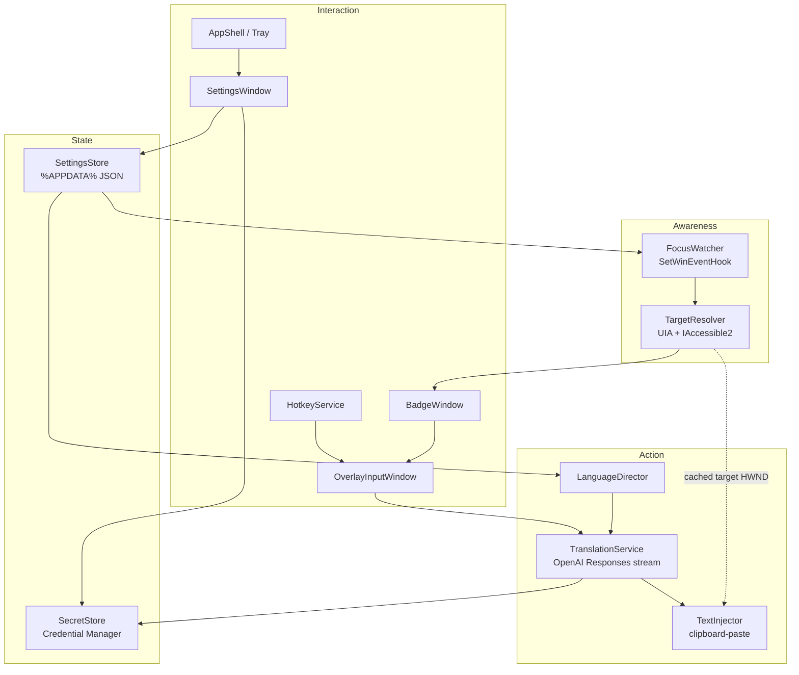

# Diagrams — components & data flow

Owner: Mehdi
Status: Accepted
Last reviewed: 2026-06-28

Companion to [../overview.md](../overview.md). Source-of-truth for component responsibilities is the
overview's component table; these diagrams only visualize relationships.

## Component map



## Translate-and-inject sequence

```mermaid
sequenceDiagram
  participant User
  participant FW as FocusWatcher
  participant TR as TargetResolver
  participant Badge as BadgeWindow
  participant Box as OverlayInputWindow
  participant TS as TranslationService
  participant TI as TextInjector
  participant App as Messenger field

  App->>FW: focus changed (allowlisted exe)
  FW->>TR: resolve focused element
  TR-->>Badge: editable target + rect (cache HWND)
  Badge-->>User: badge appears beside field
  User->>Box: click badge → type source text
  loop every keystroke
    Box->>Box: reset 500ms debounce
  end
  Box->>TS: debounced source text (cancel previous)
  TS-->>Box: streamed translation deltas
  TS->>TI: final translation
  TI->>App: select-all + paste (replace content)
  User->>App: press messenger Send
```

> Rendering note: GitHub and most IDEs render Mermaid inline. If a static export is ever needed,
> place the image under [`../../_attachments/`](../../_attachments/) and link it here.
